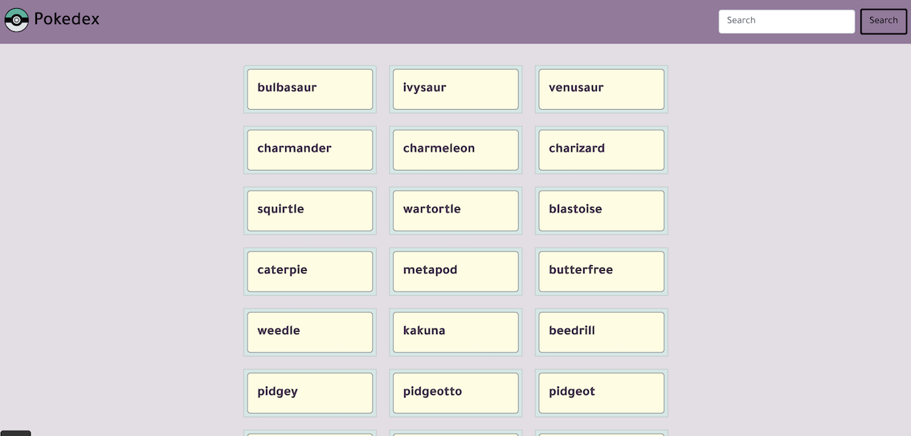
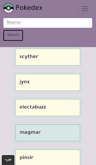

# PokeDex Web Application

## Project description

The PokeDex Web Application is a small web application created using HTML, CSS, and JavaScript. Its primary goal is to load data from the external PokeAPI and allow users to view detailed information about various Pokémon.

## Table of Contents

- [Features](#features)
- [Technologies Used](#technologies-used)
- [External API](#external-api)
- [Deployment](#deployment)
- [Screenshots](#screenshots)

## Features

- **PokeDex Listing:** The web application features a PokeDex, which is a database of Pokémon presented in a user-friendly list format.

- **Basic Search Functionality:** Users can perform basic searches to find specific Pokémon by name.

- **Detailed Information:** By clicking on a Pokémon in the list, users can access detailed information about that specific Pokémon.

## Technologies Used

- HTML
- CSS
- JavaScript
- Bootstrap (with jQuery dependency)
- ESLint
- Prettier

## External API

The web app fetches data from the [PokeAPI](https://pokeapi.co/), which provides comprehensive information about Pokémon.

## Deployment

The PokeDex Web Application is hosted on GitHub Pages and can be accessed [here](https://keylan1.github.io/simple-js-app/).

## Screenshots

| Web View                                   | Mobile View                                         |
| ------------------------------------------ | --------------------------------------------------- |
|  |    |
|                                            |  |

Thank you for using the PokeDex Web Application! We hope you enjoy exploring the world of Pokémon. If you encounter any issues or have feedback, please feel free to [report them](https://github.com/keylan1/simple-js-app/issues).
